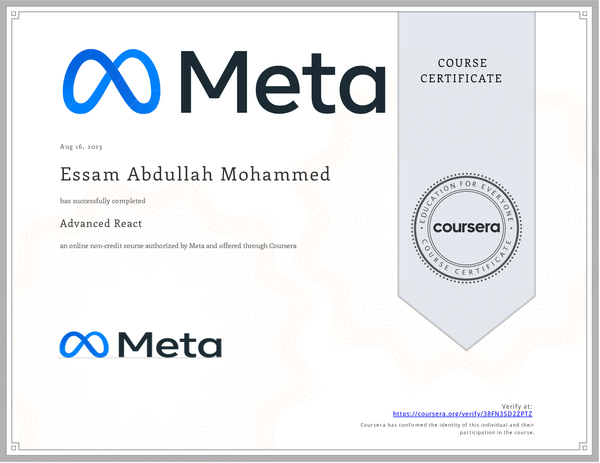

# Advanced React

- This directory contains all of my assignments from the Coursera Course: [Advanced React](https://www.coursera.org/learn/advanced-react)

## Table of Content

  - Week 1: [Components](https://github.com/x39OME/Meta-Front-End-Developer-Professional-Certificate/tree/main/6%20-%20Advanced%20React/Week%201%20-%20Components)
  - Week 2: [React Hooks and Custom Hooks](https://github.com/x39OME/Meta-Front-End-Developer-Professional-Certificate/tree/main/6%20-%20Advanced%20React/Week%202%20-%20React%20Hooks%20and%20Custom%20Hooks)
  - Week 3: [JSX and testing](https://github.com/x39OME/Meta-Front-End-Developer-Professional-Certificate/tree/main/6%20-%20Advanced%20React/Week%203%20-%20JSX%20and%20testing)
  - Week 4: [Final project](https://github.com/x39OME/Meta-Front-End-Developer-Professional-Certificate/tree/main/6%20-%20Advanced%20React/Week%204%20-%20Final%20project)

## Proof of Completion

<a href="https://www.coursera.org/account/accomplishments/verify/38FN3SD2ZPTZ"> Verified Coursera Certifies</a>

