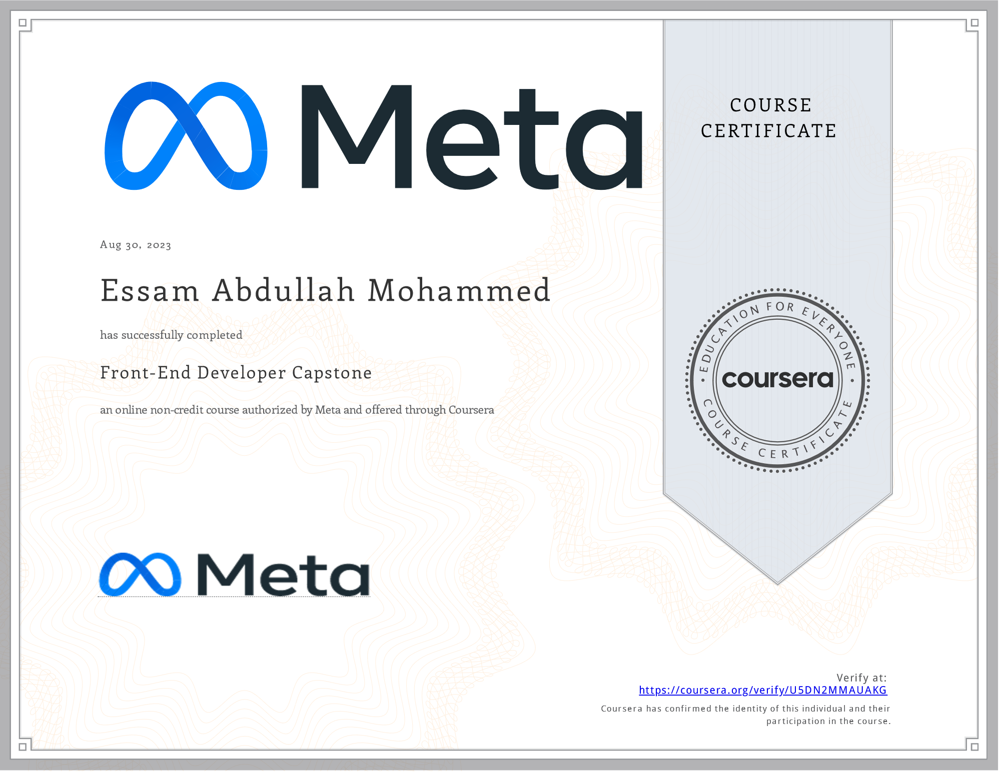

# Front-End Developer Capstone

- This directory contains all of my assignments from the Coursera Course: [Front-End Developer Capstone](https://www.coursera.org/learn/meta-front-end-developer-capstone)

## Table of Content

  - Week 1: [Starting The Project](https://github.com/x39OME/Meta-Front-End-Developer-Professional-Certificate/tree/main/8%20-%20Front-End%20Developer%20Capstone/Week%201%20-%20Starting%20the%20project)
  - Week 2: [Project Foundations](https://github.com/x39OME/Meta-Front-End-Developer-Professional-Certificate/tree/main/8%20-%20Front-End%20Developer%20Capstone/Week%202%20-%20Project%20foundations)
  - Week 3: [Project Foundations](https://github.com/x39OME/Meta-Front-End-Developer-Professional-Certificate/tree/main/8%20-%20Front-End%20Developer%20Capstone/Week%203%20-%20Project%20functionality)
  - Week 4: [Booking a table on the Little Lemon website](https://github.com/x39OME/Meta-Front-End-Developer-Professional-Certificate/tree/main/8%20-%20Front-End%20Developer%20Capstone/Week%204%20-%20Assignment%20Booking%20a%20table%20on%20the%20Little%20Lemon%20website)

## Proof of Completion

<a href="https://www.coursera.org/account/accomplishments/verify/U5DN2MMAUAKG"> Verified Coursera Certifies</a>

