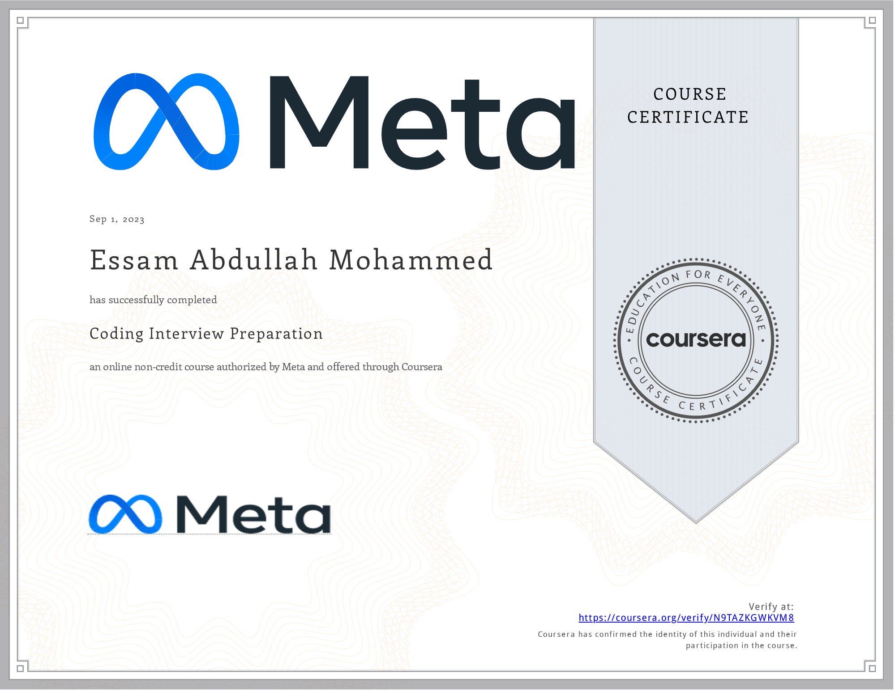

# Coding Interview Preparation

- This directory contains all of my assignments from the Coursera Course: [Coding Interview Preparation](https://www.coursera.org/learn/coding-interview-preparation)

## Table of Content

  - Week 1: [Introduction To The Coding Interview](https://github.com/x39OME/Meta-Front-End-Developer-Professional-Certificate/tree/main/9%20-%20Coding%20Interview%20Preparation/%E2%80%8F%E2%80%8FWeek%201%20-%20Introduction%20To%20The%20Coding%20Interview)
  - Week 2: [Introduction To Data Structures](https://github.com/x39OME/Meta-Front-End-Developer-Professional-Certificate/tree/main/9%20-%20Coding%20Interview%20Preparation/Week%202%20-%20Introduction%20To%20Data%20Structures)
  - Week 3: [Introduction To Algorithms](https://github.com/x39OME/Meta-Front-End-Developer-Professional-Certificate/tree/main/9%20-%20Coding%20Interview%20Preparation/Week%203%20-%20Introduction%20to%20Algorithms)
  - Week 4: [Final project]()

## Proof of Completion

<a href=""> Verified Coursera Certifies</a>

