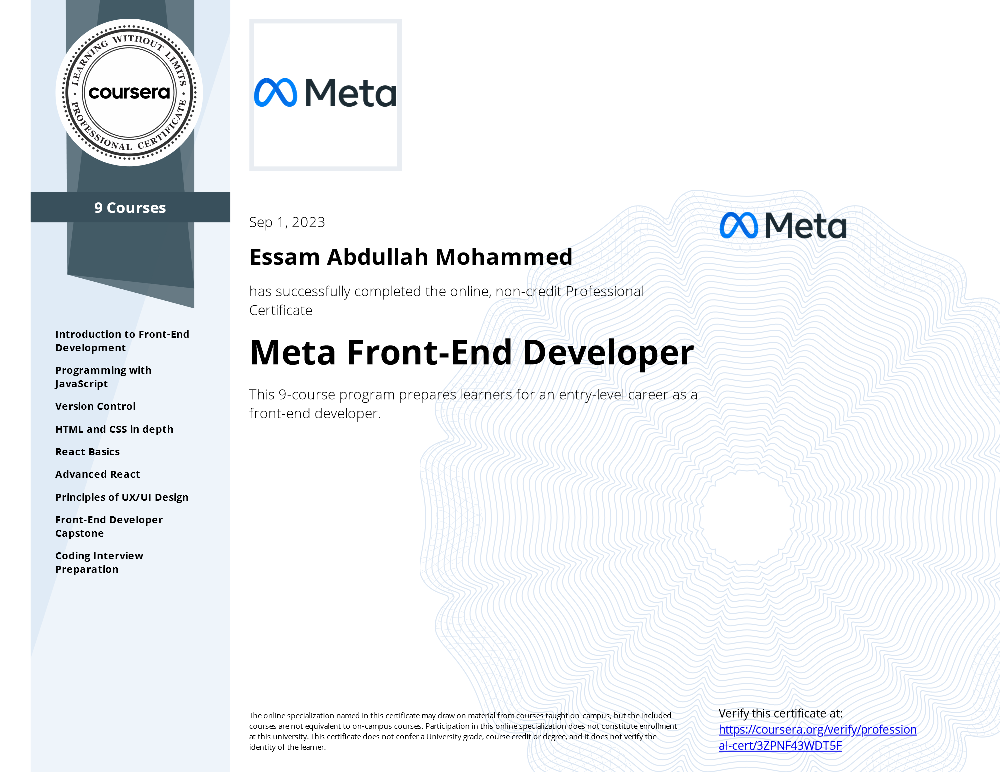

# Meta-Front-End Developer Professional Certificate

- This repo contains all of 9 courses in the Coursera Professional Certificate: [Meta Front-End Developer Professional Certificate](https://www.coursera.org/professional-certificates/meta-front-end-developer)

## Table of Content

<b>Course 1: </b><a href="https://github.com/x39OME/Meta-Front-End-Developer-Professional-Certificate/tree/main/1%20-%20Introduction%20to%20Front-End%20Development"><b>Introduction to Front-End Development</b></a>

  * Week 1: [Get started with web development](https://github.com/x39OME/Meta-Front-End-Developer-Professional-Certificate/tree/main/1%20-%20Introduction%20to%20Front-End%20Development/Week%201%20-%20Get%20started%20with%20web%20development)
  * Week 2: [Introduction to HTML and CSS](https://github.com/x39OME/Meta-Front-End-Developer-Professional-Certificate/tree/main/1%20-%20Introduction%20to%20Front-End%20Development/Week%202%20-%20Introduction%20to%20HTML%20and%20CSS)
  * Week 3: [UI Frameworks](https://github.com/x39OME/Meta-Front-End-Developer-Professional-Certificate/tree/main/1%20-%20Introduction%20to%20Front-End%20Development/Week%203%20-%20UI%20Frameworks)
  * Week 4: [End-of-Course Graded Assessment](https://github.com/x39OME/Meta-Front-End-Developer-Professional-Certificate/tree/main/1%20-%20Introduction%20to%20Front-End%20Development/Week%204%20-%20End-of-Course%20Graded%20Assessment)

<b>Course 2: </b><a href="https://github.com/x39OME/Meta-Front-End-Developer-Professional-Certificate/tree/main/2%20-%20Programming%20with%20JavaScript"><b>Programming with JavaScript</b></a>

  * Week 1: [Introduction to Javascript](https://github.com/x39OME/Meta-Front-End-Developer-Professional-Certificate/tree/main/2%20-%20Programming%20with%20JavaScript/Week%201%20-%20Introduction%20to%20Javascript)
  * Week 2: [The Building Blocks of a Program](https://github.com/x39OME/Meta-Front-End-Developer-Professional-Certificate/tree/main/2%20-%20Programming%20with%20JavaScript/Week%202%20-%20The%20Building%20Blocks%20of%20a%20Program)
  * Week 3: [Programming Paradigms](https://github.com/x39OME/Meta-Front-End-Developer-Professional-Certificate/tree/main/2%20-%20Programming%20with%20JavaScript/Week%203%20-%20Programming%20Paradigms)
  * Week 4: [Testing](https://github.com/x39OME/Meta-Front-End-Developer-Professional-Certificate/tree/main/2%20-%20Programming%20with%20JavaScript/Week%204%20-%20Testing)
  * Week 5: [End-of-Course Graded Assessment](https://github.com/x39OME/Meta-Front-End-Developer-Professional-Certificate/tree/main/2%20-%20Programming%20with%20JavaScript/Week%205%20-%20End-of-Course%20Graded%20Assessment)

<b>Course 3: </b><a href="https://github.com/x39OME/Meta-Front-End-Developer-Professional-Certificate/tree/main/3%20-%20Version%20Control"><b>Version Control</b></a>

  * Week 1: [Software collaboration](https://github.com/x39OME/Meta-Front-End-Developer-Professional-Certificate/tree/main/3%20-%20Version%20Control/Week%201%20-%20Software%20collaboration)
  * Week 2: [Command Line](https://github.com/x39OME/Meta-Front-End-Developer-Professional-Certificate/tree/main/3%20-%20Version%20Control/Week%202%20-%20Command%20Line)
  * Week 3: [Working with Git](https://github.com/x39OME/Meta-Front-End-Developer-Professional-Certificate/tree/main/3%20-%20Version%20Control/Week%203%20-%20Working%20with%20Git)
  * Week 4: [Graded Assessment](https://github.com/x39OME/Meta-Front-End-Developer-Professional-Certificate/tree/main/3%20-%20Version%20Control/Week%204%20-%20Graded%20Assessment)

<b>Course 4: </b><a href="https://github.com/x39OME/Meta-Front-End-Developer-Professional-Certificate/tree/main/4%20-%20HTML%20and%20CSS%20in%20depth"><b>HTML and CSS in depth</b></a>

* Week 1: [HTML in depth](https://github.com/x39OME/Meta-Front-End-Developer-Professional-Certificate/tree/main/4%20-%20HTML%20and%20CSS%20in%20depth/Week%201%20-%20HTML%20in%20depth)
* Week 2: [Interactive CSS](https://github.com/x39OME/Meta-Front-End-Developer-Professional-Certificate/tree/main/4%20-%20HTML%20and%20CSS%20in%20depth/Week%202%20-%20Interactive%20CSS)
* Week 3: [Graded Assessment](https://github.com/x39OME/Meta-Front-End-Developer-Professional-Certificate/tree/main/4%20-%20HTML%20and%20CSS%20in%20depth/Week%203%20-%20Graded%20Assessment)

<b>Course 5: </b><a href="https://github.com/x39OME/Meta-Front-End-Developer-Professional-Certificate/tree/main/5%20-%20React%20Basics"><b>React Basics</b></a>

  * Week 1: [React Components](https://github.com/x39OME/Meta-Front-End-Developer-Professional-Certificate/tree/main/5%20-%20React%20Basics/Week%201%20-%20React%20Components)
  * Week 2: [Data and State](https://github.com/x39OME/Meta-Front-End-Developer-Professional-Certificate/tree/main/5%20-%20React%20Basics/Week%202%20-%20Data%20and%20State)
  * Week 3: [Navigation, Updating and Assets in React.js](https://github.com/x39OME/Meta-Front-End-Developer-Professional-Certificate/tree/main/5%20-%20React%20Basics/Week%203%20-%20Navigation%2C%20Updating%20and%20Assets%20in%20React.js)
  * Week 4: [Your first React app](https://github.com/x39OME/Meta-Front-End-Developer-Professional-Certificate/tree/main/5%20-%20React%20Basics/Week%204%20-%20Your%20first%20React%20app/calculator-app)

<b>Course 6: </b><a href="https://github.com/x39OME/Meta-Front-End-Developer-Professional-Certificate/tree/main/6%20-%20Advanced%20React"><b>Advanced React</b></a>

  * Week 1: [Components](https://github.com/x39OME/Meta-Front-End-Developer-Professional-Certificate/tree/main/6%20-%20Advanced%20React/Week%201%20-%20Components)
  * Week 2: [React Hooks and Custom Hooks](https://github.com/x39OME/Meta-Front-End-Developer-Professional-Certificate/tree/main/6%20-%20Advanced%20React/Week%202%20-%20React%20Hooks%20and%20Custom%20Hooks)
  * Week 3: [JSX and testing](https://github.com/x39OME/Meta-Front-End-Developer-Professional-Certificate/tree/main/6%20-%20Advanced%20React/Week%203%20-%20JSX%20and%20testing)
  * Week 4: [Final project](https://github.com/x39OME/Meta-Front-End-Developer-Professional-Certificate/tree/main/6%20-%20Advanced%20React/Week%204%20-%20Final%20project)

<b>Course 7: </b><a href="https://github.com/x39OME/Meta-Front-End-Developer-Professional-Certificate/tree/main/7%20-%20Principles%20of%20UX-UI%20Design"><b>Principles of UI/UX Design</b></a>

  * Week 1: [Introduction to UX and UI design](https://github.com/x39OME/Meta-Front-End-Developer-Professional-Certificate/tree/main/7%20-%20Principles%20of%20UX-UI%20Design/Week%201%20-%20Introduction%20to%20UX%20and%20UI%20design)
  * Week 2: [Evaluating interactive design](https://github.com/x39OME/Meta-Front-End-Developer-Professional-Certificate/tree/main/7%20-%20Principles%20of%20UX-UI%20Design/Week%202%20-%20Evaluating%20interactive%20design)
  * Week 3: [Applied Design Fundamentals](https://github.com/x39OME/Meta-Front-End-Developer-Professional-Certificate/tree/main/7%20-%20Principles%20of%20UX-UI%20Design/Week%203%20-%20Applied%20Design%20Fundamentals)
  * Week 4: [Designing your UI](https://github.com/x39OME/Meta-Front-End-Developer-Professional-Certificate/tree/main/7%20-%20Principles%20of%20UX-UI%20Design/Week%204%20-%20Designing%20your%20UI)
  * Week 5: [Course summary and final assessment](https://github.com/x39OME/Meta-Front-End-Developer-Professional-Certificate/tree/main/7%20-%20Principles%20of%20UX-UI%20Design/Week%205%20-%20Course%20summary%20and%20final%20assessment)

<b>Course 8: </b><a href="https://github.com/x39OME/Meta-Front-End-Developer-Professional-Certificate/tree/main/8%20-%20Front-End%20Developer%20Capstone"><b>Front-End Developer Capstone</b></a>

  * Week 1: [Starting The Project](https://github.com/x39OME/Meta-Front-End-Developer-Professional-Certificate/tree/main/8%20-%20Front-End%20Developer%20Capstone/Week%201%20-%20Starting%20the%20project)
  * Week 2: [Project Foundations](https://github.com/x39OME/Meta-Front-End-Developer-Professional-Certificate/tree/main/8%20-%20Front-End%20Developer%20Capstone/Week%202%20-%20Project%20foundations)
  * Week 3: [Project Foundations](https://github.com/x39OME/Meta-Front-End-Developer-Professional-Certificate/tree/main/8%20-%20Front-End%20Developer%20Capstone/Week%203%20-%20Project%20functionality)
  * Week 4: [Booking a table on the Little Lemon website](https://github.com/x39OME/Meta-Front-End-Developer-Professional-Certificate/tree/main/8%20-%20Front-End%20Developer%20Capstone/Week%204%20-%20Assignment%20Booking%20a%20table%20on%20the%20Little%20Lemon%20website)

<b>Course 9: </b><a href="https://github.com/x39OME/Meta-Front-End-Developer-Professional-Certificate/tree/main/9%20-%20Coding%20Interview%20Preparation"><b>Coding Interview Preparation</b></a>

  * Week 1: [Introduction To The Coding Interview](https://github.com/x39OME/Meta-Front-End-Developer-Professional-Certificate/tree/main/9%20-%20Coding%20Interview%20Preparation/%E2%80%8F%E2%80%8FWeek%201%20-%20Introduction%20To%20The%20Coding%20Interview)
  * Week 2: [Introduction To Data Structures](https://github.com/x39OME/Meta-Front-End-Developer-Professional-Certificate/tree/main/9%20-%20Coding%20Interview%20Preparation/Week%202%20-%20Introduction%20To%20Data%20Structures)
  * Week 3: [Introduction To Algorithms](https://github.com/x39OME/Meta-Front-End-Developer-Professional-Certificate/tree/main/9%20-%20Coding%20Interview%20Preparation/Week%203%20-%20Introduction%20To%20Algorithms)
  * Week 4: [Final project]()

## Proof of Completion

- <a href=""> Verified Coursera Certifies</a>

